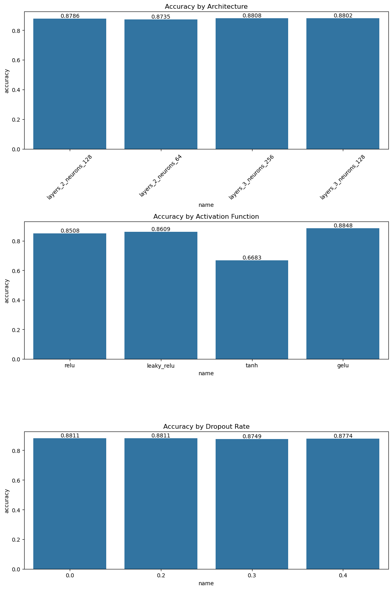
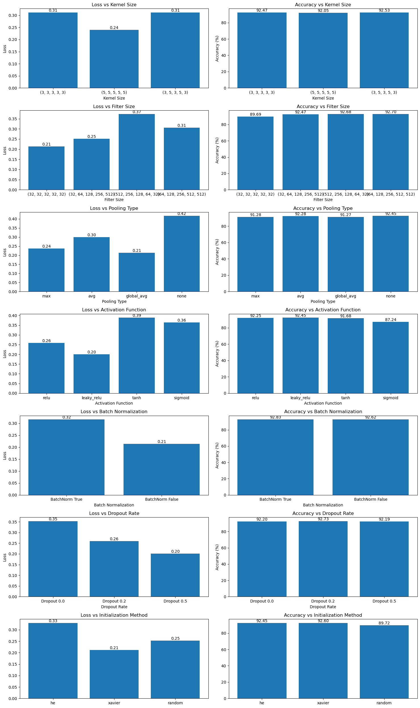

# Fashion MNIST Classification using CNN and MLP from Scratch

## Table of Contents
1. [Project Overview](#project-overview)
2. [Installation](#installation)
3. [Dataset](#dataset)
4. [Implementation Details](#implementation-details)
    - [MLP Implementation](#mlp-implementation)
    - [CNN Implementation](#cnn-implementation)
    - [Feature Extraction and Hybrid Model](#feature-extraction-and-hybrid-model)
5. [Model Architectures](#model-architectures)
6. [Experiments and Results](#experiments-and-results)
7. [Usage](#usage)

## Project Overview
This project implements a deep learning solution for classifying Fashion MNIST images using both Multi-Layer Perceptron (MLP) and Convolutional Neural Network (CNN) architectures from scratch. The implementation includes a hybrid approach where CNN is used for feature extraction followed by MLP classification.

## Installation
```bash
git clone [repository-url]
cd [repository-name]

# Required dependencies
pip install numpy
pip install pandas
pip install torch
pip install matplotlib
pip install seaborn
pip install sklearn
```

## Dataset
The Fashion MNIST dataset consists of 70,000 grayscale images (28x28 pixels) across 10 fashion categories:
- Training set: 48,000 images
- Validation set: 12,000 images
- Test set: 10,000 images

Each image is normalized to have pixel values between 0 and 1.

## Implementation Details

### MLP Implementation
- **Architecture**: Fully connected layers with configurable dimensions
- **Key Features**:
  - Custom implementation of forward and backward passes
  - Support for multiple activation functions (ReLU, Leaky ReLU, Tanh, GELU)
  - Dropout regularization
  - Custom cross-entropy loss implementation
  - Dynamic learning rate adjustment

### CNN Implementation
- **Architecture**: 5 convolutional layers with configurable parameters
- **Key Features**:
  - Configurable kernel sizes and filter numbers
  - Multiple pooling options (Max, Average, Global Average)
  - Batch normalization support
  - Different weight initialization methods (He, Xavier, Random)
  - Feature extraction capabilities

### Feature Extraction and Hybrid Model
- CNN backbone for feature extraction
- MLP classifier using extracted features
- Combined training pipeline

## Model Architectures

### MLP Architecture
```
Input Layer (784) → Hidden Layer 1 (128) → Hidden Layer 2 (64) → Output Layer (10)
```

### CNN Architecture
```
Input (28x28x1) →
Conv1 + BatchNorm + ReLU + MaxPool →
Conv2 + BatchNorm + ReLU + MaxPool →
Conv3 + BatchNorm + ReLU + MaxPool →
Conv4 + BatchNorm + ReLU + MaxPool →
Conv5 + BatchNorm + ReLU →
MLP Classifier
```

## Experiments and Results

### MLP Experiments

- Different architectures tested
- Activation function comparison
- Dropout rate analysis
- Best configuration achieved 90.10% accuracy

### CNN Experiments

- Kernel size variations
- Filter configurations
- Pooling methods comparison
- Initialization methods analysis
- Best configuration achieved 93.28% accuracy

### Hybrid Model Performance

- Feature extraction analysis
- Final test accuracy: 93.37%
- Detailed performance metrics

## Usage
```python
# For MLP training
python3 MLP_from_scratch.py

# For CNN and feature extraction
python3 CNN_feature_extraction.py
```
